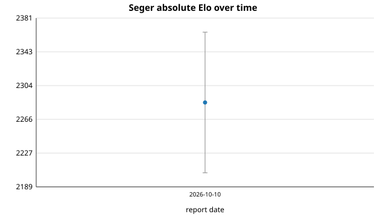

# Seger Elo report — 2026-10

**Verdict: within noise.** No engine change landed this month; the current
`HEAD` is byte-for-byte the pinned reference, so the only movement measured is
run-to-run variance.

## Self-play vs the pinned reference

- Command: `python3 tools/selfplay.py --a build/seger --b /tmp/seger_ref_bin --games 60 --depth 5 --parallel 4`
- Reference sha (`reports/elo/baseline.sha`): `e58ee82621563a26ad2edd7138d91d6fc03e71f1`
- Result: A 15 W, 22 D, 23 L — **A score 26.0/60 = 0.433**, Elo delta **-46.6** (+/- 89 at 95%).

`HEAD` and the reference are the same commit, so the two binaries are
identical. A -47 Elo reading on identical builds is pure sampling noise, and it
sits comfortably inside the +/- 89 interval. It calibrates the error bar for
this month rather than recording a real regression.

## Absolute strength vs Stockfish

Stockfish 19 (`sf_19`, linux x86-64) limited with `UCI_LimitStrength`/`UCI_Elo`,
one thread, 100 ms/move, colours alternated over the opening set.
Command: `python3 tools/vs_stockfish.py --seger build/seger --stockfish <sf> --elo 2200 --elo 2300 --games 40 --movetime 0.1`.

| SF anchor | Seger score | W/D/L | Seger estimate | 95% interval |
|-----------|-------------|-------|----------------|--------------|
| 2200      | 0.562       | 19/7/14 | 2244        | +/- 109      |
| 2300      | 0.537       | 14/15/11 | 2326       | +/- 108      |

Combined point estimate: **~2285 Elo**. The two anchors bracket the estimate
consistently (they do not disagree with each other), but each anchor's interval
is over 100 Elo wide at 40 games, so treat 2285 as a ballpark, not a precise
rating. Stockfish is the reference's own `UCI_Elo` calibration at a short time
control, not an official rating-list number.

## Commits on main since the previous report

There is no previous report (this is the first). The repository is a shallow,
single-commit checkout, so only the pinned baseline is visible:

- `e58ee82` Speed up move-order scoring by caching captureScore

## Honest note

The self-play delta (-46.6 Elo) is smaller in magnitude than its own confidence
interval (+/- 89) and was measured between two identical binaries. There is
therefore **no evidence of a real strength change** this month; the engine is
flat at ~2285 (ballpark) Elo.
